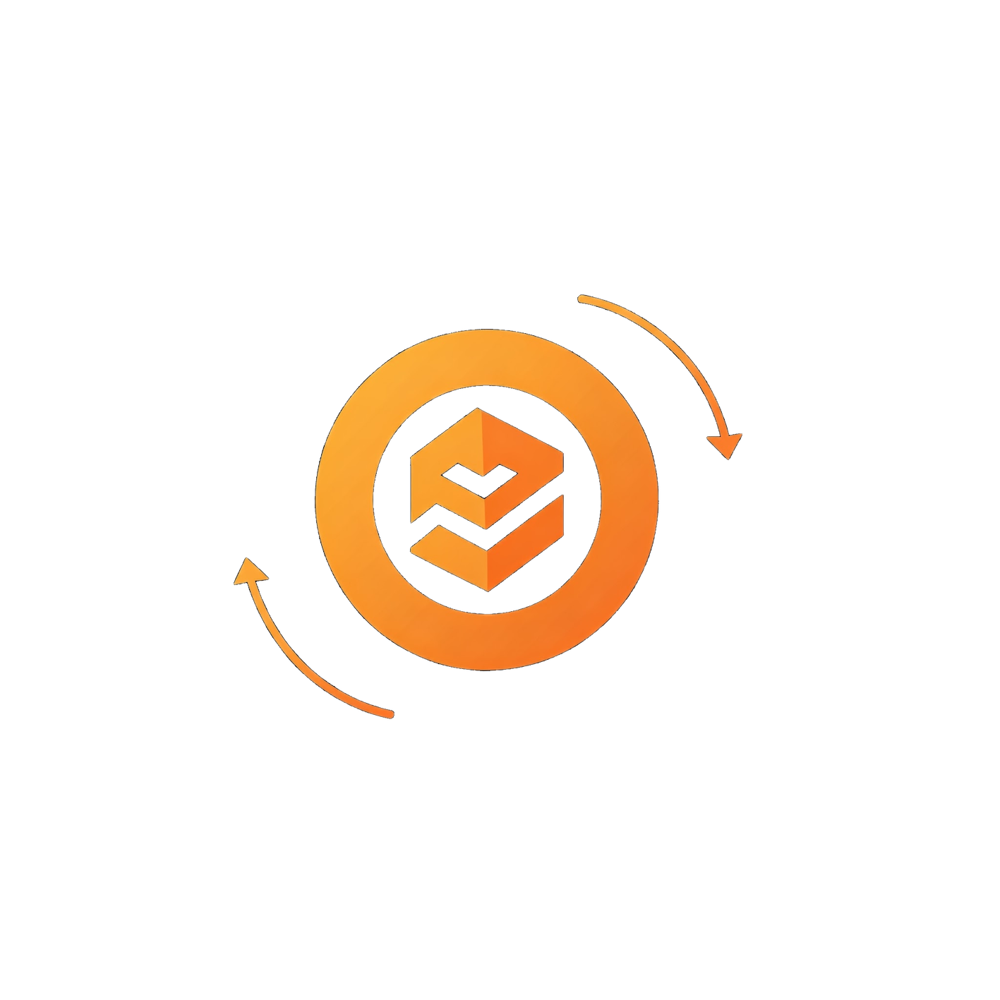

<div align="center">
    
</div>

# ZkCredit - The First ZeroKnowlege Personal Loan (Credit) DeFi App

This project is developed based on MINA's [Protokit](https://github.com/proto-kit) [starter-kit](https://github.com/proto-kit/starter-kit) ([original README](https://github.com/proto-kit/starter-kit/blob/develop/README.md)).

## Full Description

Lending protocols in crypto have always required large collateralization of assets. This in turn makes web3 unsuitable for one of the most basic aspects of tradfi: credit. Our project uses the same principles used for centuries by tradfi, ownership of assets (in our case homes), and proof of income to enable lenders to provide credit without the need for collateral.

"However, if this has been something tradfi has done for centuries, why is this even worth exploring?" This is a question we asked ourselves when thinking about this problem. After much deliberation, we came to the conclusion that nobody wants their income slip or home address on the blockchain, for everybody to see. Privacy is a major concern for borrowers. This is why zkSNARKs are crucial to our project, enabling us to prove asset ownership and income without revealing that information to the blockchain.

Using Mina's provable code model and the Protokit SDK, we developed a lending protocol that allows borrowers to prove their creditworthiness while ensuring that their private information is kept hidden. Lenders can specify exactly how credit-worthy (asset value/ income) they want their borrowers to be as well as the interest rates and payback duration. These offers can then be taken up by interested borrowers, who prove that they have met the constraints of the offer using a ZK proof.

We also designed a traceable identity system and a blacklist to ensure that bad actors are banned from the lending protocol. Using this system, a bad actor cannot just change their wallet address (create a new wallet) and borrow money again since the blacklist would ban their assets as well. In the future, we would utilize an insurance fund to insure lenders. However, we were not able to finish this feature due to time constraints.

Our model also allows for an orderbook-style loan marketplace where lenders can specify exactly what kinds of loans they are willing to give and borrowers can be matched with the best possible loans.

### Implementation

The project is based on the hybrid runtime model of Mina and utilizes the Protokit to build and prove the constraints for the proof of assets and income. We initially planned to use government entities' signatures to prove the ownership of assets (such as the ECDSA signature used by the Singapore Government in Singpass) however, as of now, we could not find an sdk/open source project on Mina that does so for any reasonable signature scheme. Instead, we hacked together a Merkle tree implementation where the leaves are assets of every individual in a country, a Merkle tree constructed by the government. Borrowers then prove their Merkle proof of inclusion as well as showing that the assets satisfy min_value constraints.

We also designed a traceable identity system, utilizing a nonce, hashes of the assets, and only one message between a borrower and a lender. This way, a defaulting borrower can be blacklisted and their assets cannot be reused for another loan. In the future, we may use Worldcoin ID for this feature.


## Quick start

**Prerequisites:**

- Node.js `v18` (we recommend using NVM)
- pnpm `v9.8`
- nvm

To install NVM in MacOS, follow this [guide](https://sukiphan.medium.com/how-to-install-nvm-node-version-manager-on-macos-d9fe432cc7db).

To install NVM in Ubuntu, follow this [guide](https://github.com/nvm-sh/nvm?tab=readme-ov-file#installing-and-updating).

## Setup

```zsh
git clone https://github.com/EkamSinghPandher/ZkCredit
cd MinaLend
nvm install v18
nvm use
pnpm install
```


## Running

```zsh
pnpm env:inmemory dev
```

Then open [http://localhost:3000/](http://localhost:3000/) in your browser.

## Testing

```zsh
pnpm run test --filter=chain -- --watchAll
```

## Future Work
- Integrate a Mina <-> Ethereum bridge such as the LambdaClass [mina_bridge](https://github.com/lambdaclass/mina_bridge). Note that mina_bridge is work-in-progress. We plan to integrate it when the project is in a relatively stable form.

- Integrate [SingPass](https://api.singpass.gov.sg/) to get proof of assets in Singapore.

- Integrate [worldcoin](https://worldcoin.org/) ID into the traceable identity feature.